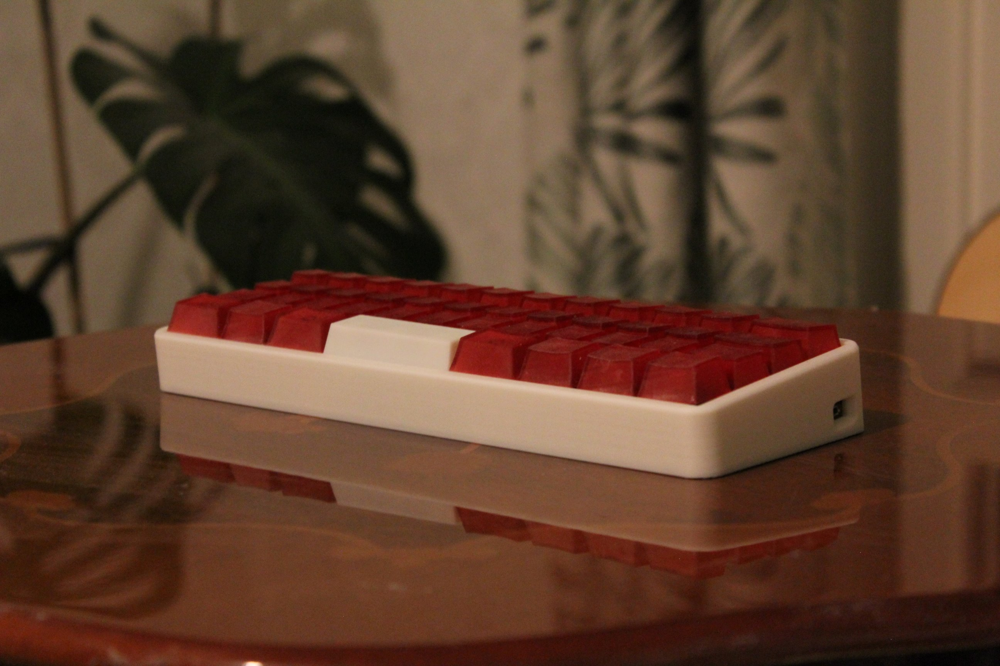
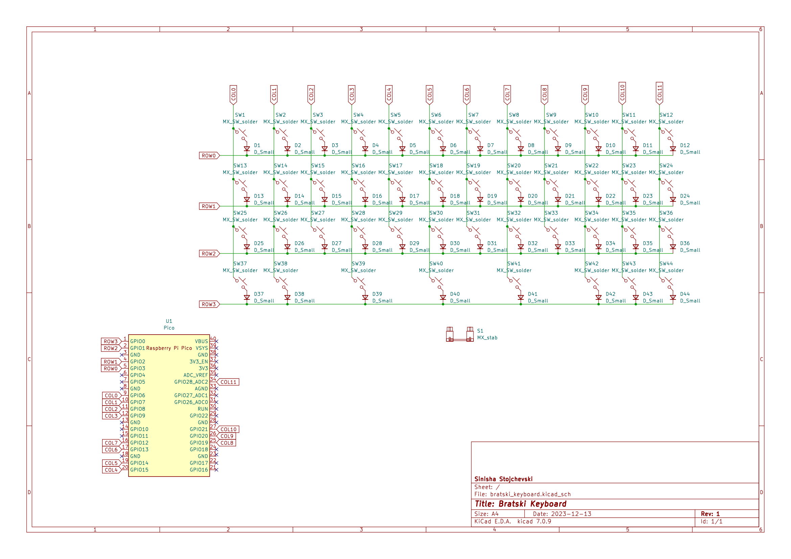
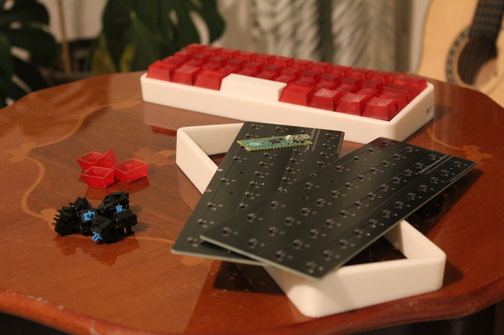
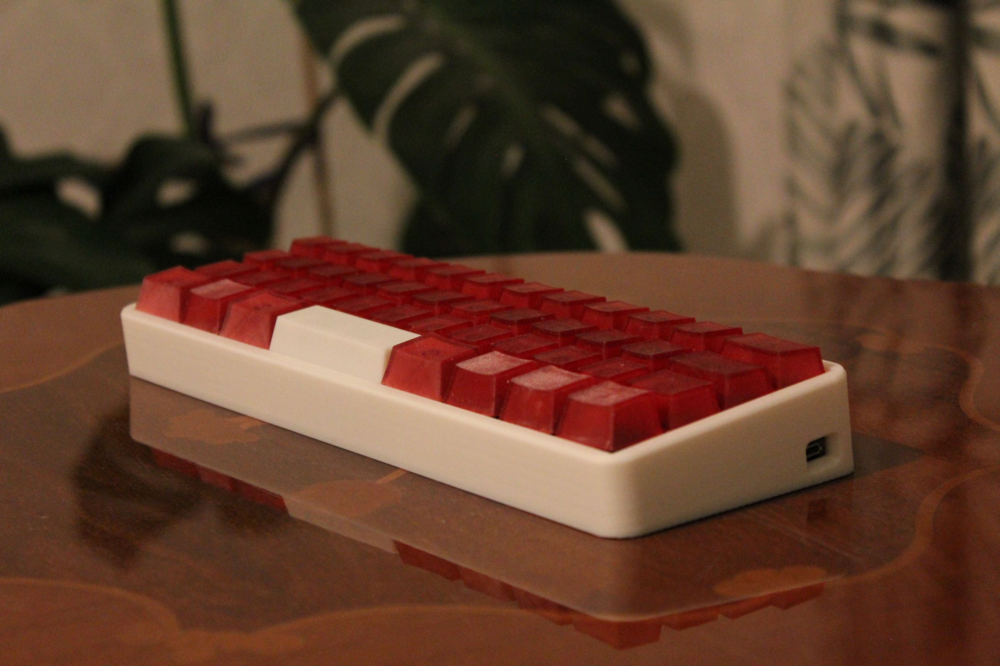
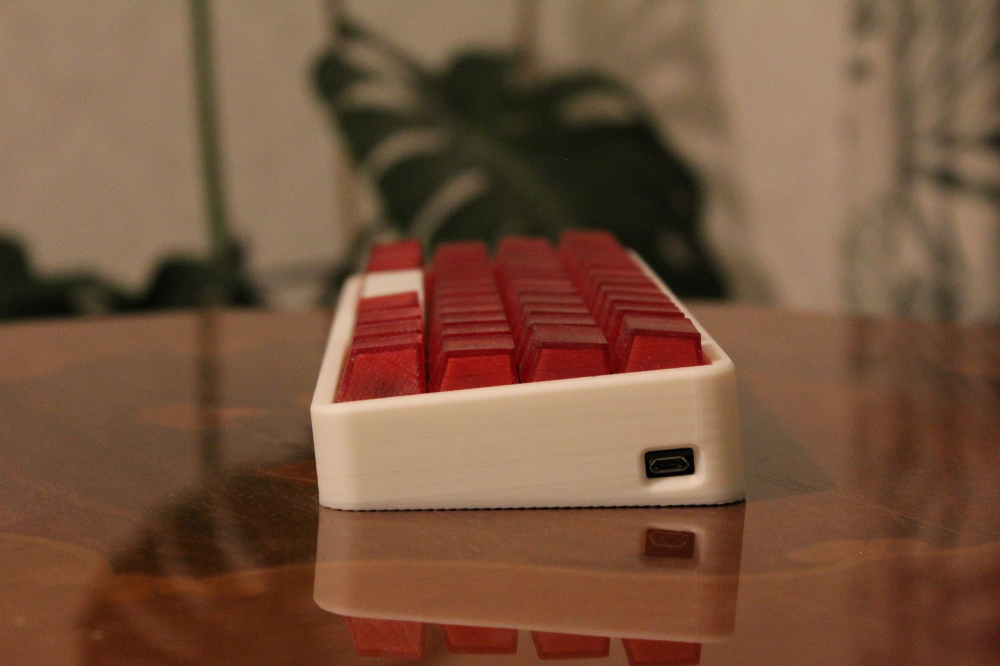
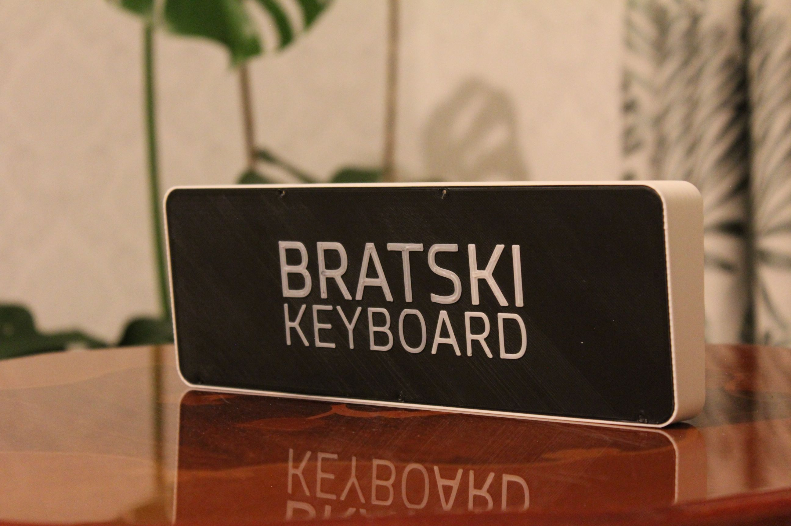

# Bratski Keyboard

The Bratski Keyboard, named after the Slavic slang term "братски" meaning brother, is a compact mechanical keyboard powered by the Raspberry Pi Pico (RP2040) microcontroller. Designed with 44 soldered keys, it is optimized for seamless use with tablets, laptops, or smartphones. The keyboard boasts MX switches, renowned for their exceptional typing feel and durability, paired with custom resin-printed keycaps, delivering a distinctive and satisfying typing experience. Enhancing the overall robustness, the 3D-printed case, comprised of a main body and a back cover, completes the Bratski Keyboard's durable design.

## Project Structure

The project repository is structured as follows:

-   **`kicad/`**: Contains PCB design files and schematics.
-   **`gerbers/`**: Includes Gerber files essential for manufacturing.
-   **`case/`**: Consists of 3D print files for both the main body and the back cover of the keyboard.
-   **`firmware/`**: Incorporates a modified version of the KMK Firmware with custom key mappings.
-   **`keycaps/`**: MX Keycaps and modified version of the 3u keycap used on the keyboard.

## Pinout and Mapping

## Raspberry Pi Pico Firmware

To enable key mappings on the Raspberry Pi Pico, the Bratski Keyboard employs the KMK firmware. Follow these steps to set it up:

1. Install **[MicroPython](https://www.raspberrypi.com/documentation/microcontrollers/micropython.html)** from the official Raspberry Pi website.
2. Visit the official **[KMK](http://kmkfw.io/)** webpage, download the firmware, customize key mappings as per your preferences and pinouts, and install it on your Raspberry Pi.

_Note:_ If you prefer using the predefined key mappings provided in this repository, you can install the custom firmware available in the firmware folder.

## Keycaps

The Bratski keyboard features keycaps from the **[ConstantinoSchillebeeckx](https://github.com/ConstantinoSchillebeeckx/cherry-mx-keycaps)** collection. These keycaps, crafted using a resin printer, are compatible with MX switches. However, the keyboard supports all MX-compatible keycaps, providing users with flexibility in choosing and customizing their keycap sets.

